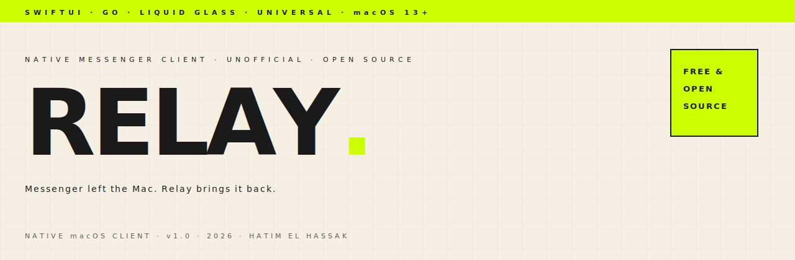

<div align="center">

<picture>
  <source media="(prefers-color-scheme: dark)" srcset="assets-readme/hero-banner-dark.svg">
  
</picture>

<br><br>

[](#-compatibility)
[](#-compatibility)
[](https://developer.apple.com/swiftui/)
[](https://go.dev)
[](../../releases/latest)
[](LICENSE)

<br>

_A premium **<strong>native macOS client</strong>** for **<strong>Facebook Messenger</strong>** — SwiftUI + Liquid Glass over a Go backend that speaks Meta's real protocol. **<strong>Not a web wrapper.</strong>** Universal (**<strong>Intel + Apple Silicon</strong>**), macOS&nbsp;13+, with in-app updates, on-device translation, and your whole history searchable locally. Built to fill the gap after Meta killed the Mac Messenger app._

</div>

---

> [!WARNING]
> **Relay is an unofficial client.** It logs into your real Facebook account using reverse-engineered protocols (the same ones the [mautrix-meta](https://github.com/mautrix/meta) / [whatsmeow](https://github.com/tulir/whatsmeow) bridges use). Meta does not permit third-party clients — **your account could be rate-limited or banned.** Your session is stored only in your **macOS Keychain** and sent only to Meta, exactly like a browser. Relay has no servers and collects nothing. Use at your own risk. Not affiliated with Meta.

### `/// WHY`

Meta retired the Messenger desktop app and shut down messenger.com — leaving the Mac with a browser tab or nothing. Relay is a real, first-class Mac app to take its place: a SwiftUI client (Liquid Glass on macOS 26, frosted material below) driven by a Go helper that decodes Meta's actual Lightspeed + encrypted protocols. Fast, keyboard-driven, glassy — and it runs on the Intel Macs everyone forgot.

### `/// INSTALL`

```
┌──────────────────────────────────────────────────────────────────────┐
│  1.  Download  Relay.dmg  from the Releases page                       │
│  2.  Open it → drag Relay.app into Applications                        │
│  3.  Approve it ONCE (free open-source app, not Apple-notarized):      │
│        macOS 15 / 26 →  open it, click Done, then                      │
│                         System Settings → Privacy & Security →         │
│                         "Open Anyway"                                  │
│        macOS 13 / 14 →  right-click Relay.app → Open → Open            │
│  4.  Welcome screen → sign into Facebook (password / 2FA / checkpoints)│
└──────────────────────────────────────────────────────────────────────┘
```

⬇️ **[Download the latest release →](../../releases/latest)**

### `/// FEATURES`

```
┌─ MESSAGING   → send/receive · reactions · replies · edit · unsend · forward
├─ MEDIA       → multi-image send · drag & drop · voice notes · emoji + GIFs
├─ ORGANISE    → scheduled send · snooze · pin · mute · saved messages · folders
├─ FIND        → in-chat search + global full-text search over all local history
├─ PERSONALISE → per-chat accent colors · wallpapers · nicknames
├─ SMART       → on-device translation (message or whole chat, macOS 15+)
├─ MAC-NATIVE  → menu-bar companion · inline-reply notifications · Touch ID lock
│                Siri / Shortcuts intents · ⌘K switcher · conversation export
└─ FAST        → SQLite history with a short sliding window — smooth on slow Macs
```

### `/// COMPATIBILITY`

Runs on **macOS 13 Ventura or later**, **Apple Silicon and Intel** (app + backend are universal binaries). Newer-OS features light up automatically; older Macs still get a fully working app.

| Feature | macOS 13 | macOS 14 | macOS 15 | macOS 26 |
|---|:--:|:--:|:--:|:--:|
| Messaging · history · search · media · login | ✅ | ✅ | ✅ | ✅ |
| Liquid Glass UI | frosted | frosted | frosted | ✅ glass |
| On-device translation · jump-to-bottom pill | — | — | ✅ | ✅ |

### `/// UPDATES`

Updates are **manual** — no background checks, nothing phones home on its own. **Settings → Download the Latest Version** (or *Relay → Check for Updates…*) fetches and installs the newest build in one click, verified by signature (Sparkle). No need to come back to GitHub.

### `/// HOW IT WORKS`

```
  Relay.app (SwiftUI)  ⇄  stdio / JSON  ⇄  relay-helper (Go)  ⇄  Meta
```

- **`RelayNative/`** — the SwiftUI app (folder name predates the rename to "Relay").
- **`relay-helper/`** — a Go daemon the app launches and talks to over a pipe; uses `mautrix-meta` (non-E2EE / Lightspeed) and `whatsmeow` (E2EE) to decode Meta's real protocol.
- **`thirdparty/mautrix-meta`** — vendored fork (AGPL-3.0).

### `/// BUILD`

Requires Xcode 26+, Go, and [`xcodegen`](https://github.com/yonsm/XcodeGen) (`brew install xcodegen`).

```bash
git clone https://github.com/hatimhtm/Relay && cd Relay
scripts/run-native.sh      # build helper + app, sign locally, install, launch
scripts/release.sh         # → dist/Relay.dmg + Relay.zip + signed appcast.xml
```

See [`BUILD.md`](BUILD.md) and [`RELEASE.md`](RELEASE.md) for details.

### `/// LICENSE`

**AGPL-3.0** — see [`LICENSE`](LICENSE). Required because Relay statically incorporates AGPL-3.0 code (mautrix-meta); the complete corresponding source stays available. Third-party components are credited in [`THIRD-PARTY-NOTICES.md`](THIRD-PARTY-NOTICES.md).

<div align="center"><br><sub>Relay is an independent project — <strong>not affiliated with, authorized, or endorsed by Meta Platforms, Inc.</strong> All trademarks belong to their owners.</sub></div>
